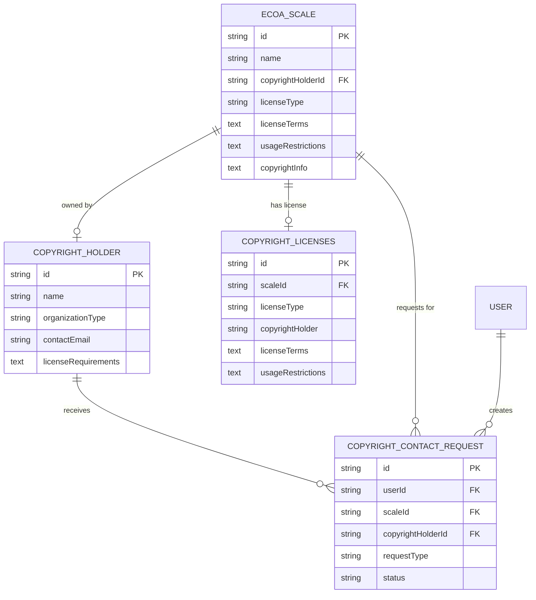

# 数据库 ER 关系图文档

## 概览

本文档详细描述了 Open eCOA 平台的数据库结构、表关系和字段定义。数据库采用 SQLite 设计，使用 Drizzle ORM 进行管理。

## 核心模块

### 1. 用户与认证模块

#### 用户表 (user)
```sql
Table: user
Primary Key: id (usr_xxxx)
Fields:
├── id                  - 用户唯一标识
├── firstName           - 名
├── lastName            - 姓
├── email               - 邮箱地址 (unique)
├── passwordHash        - 密码哈希
├── role                - 角色 (admin/user)
├── emailVerified       - 邮箱验证时间戳
├── signUpIpAddress     - 注册IP地址
├── googleAccountId     - Google账户ID
├── avatar              - 头像路径
├── currentCredits      - 当前积分
├── lastCreditRefreshAt - 最后积分刷新时间
└── commonColumns       - 创建/更新时间戳
```

#### 通行密钥凭证表 (passkey_credential)
```sql
Table: passkey_credential
Primary Key: id (pkey_xxxx)
Foreign Keys:
└── userId → user.id
Fields:
├── credentialId        - 凭证ID (unique)
├── credentialPublicKey - 公钥
├── counter             - 计数器
├── transports          - 传输方式 (JSON)
├── aaguid              - 认证器GUID
├── userAgent           - 用户代理
└── ipAddress           - IP地址
```

### 2. 团队管理模块

#### 团队表 (team)
```sql
Table: team
Primary Key: id (team_xxxx)
Foreign Keys:
└── ownerId → user.id
Fields:
├── name                - 团队名称
├── slug                - URL友好名称
├── description         - 团队描述
├── avatar              - 团队头像
├── isPersonal          - 是否个人团队
└── settings            - 团队设置 (JSON)
```

#### 团队成员表 (team_membership)
```sql
Table: team_membership
Primary Key: id (member_xxxx)
Foreign Keys:
├── teamId → team.id
├── userId → user.id
└── roleId → team_role.id
Fields:
├── joinedAt            - 加入时间
└── isActive            - 是否活跃
```

#### 团队角色表 (team_role)
```sql
Table: team_role
Primary Key: id (role_xxxx)
Foreign Keys:
└── teamId → team.id
Fields:
├── name                - 角色名称
├── description         - 角色描述
├── permissions         - 权限列表 (JSON)
└── isDefault           - 是否默认角色
```

#### 团队邀请表 (team_invitation)
```sql
Table: team_invitation
Primary Key: id (invite_xxxx)
Foreign Keys:
├── teamId → team.id
├── invitedByUserId → user.id
└── roleId → team_role.id
Fields:
├── email               - 被邀请邮箱
├── token               - 邀请令牌
├── expiresAt           - 过期时间
├── acceptedAt          - 接受时间
└── declinedAt          - 拒绝时间
```

### 3. eCOA 量表核心模块

#### 量表分类表 (ecoa_category)
```sql
Table: ecoa_category
Primary Key: id (cat_xxxx)
Fields:
├── name                - 分类名称
├── nameEn              - 英文名称
├── description         - 分类描述
├── sortOrder           - 排序顺序
└── isActive            - 是否活跃
```

#### 量表主表 (ecoa_scale)
```sql
Table: ecoa_scale
Primary Key: id (scale_xxxx)
Foreign Keys:
├── categoryId → ecoa_category.id
└── copyrightHolderId → copyright_holder.id
Fields:
├── name                - 量表名称
├── nameEn              - 英文名称
├── acronym             - 缩写
├── description         - 描述
├── descriptionEn       - 英文描述
├── itemsCount          - 题项数量
├── dimensionsCount     - 维度数量
├── languages           - 支持语言 (JSON Array)
├── validationStatus    - 验证状态 (draft/validated/published)
├── copyrightInfo       - 版权信息
├── scoringMethod       - 评分方法
├── administrationTime  - 施测时间 (分钟)
├── targetPopulation    - 目标人群
├── ageRange            - 年龄范围
├── domains             - 应用领域 (JSON Array)
├── psychometricProperties - 心理测量属性 (JSON)
├── references          - 参考文献 (JSON Array)
├── downloadUrl         - 下载链接
├── isPublic            - 是否公开
├── usageCount          - 使用次数
├── favoriteCount       - 收藏次数
├── searchVector        - 搜索向量
├── licenseType         - 许可类型
├── licenseTerms        - 许可条款
└── usageRestrictions   - 使用限制
```

#### 量表题项表 (ecoa_item)
```sql
Table: ecoa_item
Primary Key: id (item_xxxx)
Foreign Keys:
└── scaleId → ecoa_scale.id
Fields:
├── itemNumber          - 题项编号
├── question            - 题目内容
├── questionEn          - 英文题目
├── dimension           - 所属维度
├── responseType        - 回答类型 (likert/boolean/numeric/text)
├── responseOptions     - 回答选项 (JSON Array)
├── scoringInfo         - 计分信息
├── isRequired          - 是否必答
└── sortOrder           - 排序顺序
```

### 4. 用户行为模块

#### 搜索历史表 (user_search_history)
```sql
Table: user_search_history
Primary Key: id (search_xxxx)
Foreign Keys:
└── userId → user.id
Fields:
├── query               - 搜索查询
├── filters             - 筛选条件 (JSON)
├── resultsCount        - 结果数量
├── searchType          - 搜索类型 (general/semantic/advanced)
└── ipAddress           - IP地址
```

#### 用户收藏表 (user_favorite)
```sql
Table: user_favorite
Primary Key: id (fav_xxxx)
Foreign Keys:
├── userId → user.id
└── scaleId → ecoa_scale.id
Fields:
└── notes               - 收藏备注
```

#### 量表使用记录表 (scale_usage)
```sql
Table: scale_usage
Primary Key: id (usage_xxxx)
Foreign Keys:
├── scaleId → ecoa_scale.id
└── userId → user.id (nullable)
Fields:
├── actionType          - 操作类型 (view/download/favorite/search_result)
├── ipAddress           - IP地址
├── userAgent           - 用户代理
└── referrer            - 来源页面
```

### 5. 版权管理模块

#### 版权方表 (copyright_holder)
```sql
Table: copyright_holder
Primary Key: id (copyright_xxxx)
Fields:
├── name                - 版权方名称
├── nameEn              - 英文名称
├── organizationType    - 组织类型 (publisher/research_institution/individual/foundation)
├── website             - 官网链接
├── description         - 描述
├── descriptionEn       - 英文描述
├── contactEmail        - 联系邮箱
├── contactPhone        - 联系电话
├── contactMobile       - 手机号码
├── contactFax          - 传真号码
├── contactAddress      - 联系地址
├── licenseTypes        - 许可类型 (JSON Array)
├── licenseRequirements - 许可要求
├── pricingInfo         - 价格信息
├── isActive            - 是否活跃
└── isVerified          - 是否已验证
```

#### 版权许可表 (copyright_licenses)
```sql
Table: copyright_licenses
Primary Key: id (license_xxxx)
Foreign Keys:
└── scaleId → ecoa_scale.id
Fields:
├── licenseType         - 许可类型
├── copyrightHolder     - 版权方名称
├── contactEmail        - 联系邮箱
├── contactPhone        - 联系电话
├── website             - 网站
├── licenseTerms        - 许可条款
├── commercialCost      - 商业费用
├── academicCost        - 学术费用
├── usageRestrictions   - 使用限制
├── applicationProcess  - 申请流程
└── responseTime        - 响应时间
```

#### 版权联系请求表 (copyright_contact_request)
```sql
Table: copyright_contact_request
Primary Key: id (contact_xxxx)
Foreign Keys:
├── userId → user.id
├── scaleId → ecoa_scale.id
└── copyrightHolderId → copyright_holder.id
Fields:
├── requestType         - 请求类型 (license_inquiry/usage_request/support/other)
├── intendedUse         - 使用目的 (clinical/research/commercial/education)
├── organizationName    - 组织名称
├── organizationType    - 组织类型
├── contactName         - 联系人姓名
├── contactEmail        - 联系邮箱
├── contactPhone        - 联系电话
├── message             - 消息内容
├── status              - 状态 (pending/sent/responded/completed/failed)
├── sentAt              - 发送时间
├── responseReceived    - 回复时间
└── adminNotes          - 管理员备注
```

### 6. 积分与支付模块

#### 积分交易表 (credit_transaction)
```sql
Table: credit_transaction
Primary Key: id (credit_xxxx)
Foreign Keys:
├── userId → user.id
└── teamId → team.id (nullable)
Fields:
├── type                - 交易类型 (PURCHASE/USAGE/REFUND/GRANT)
├── amount              - 积分数量
├── description         - 交易描述
├── metadata            - 元数据 (JSON)
└── status              - 交易状态
```

#### 购买项目表 (purchased_items)
```sql
Table: purchased_items
Primary Key: id (purchase_xxxx)
Foreign Keys:
└── userId → user.id
Fields:
├── itemType            - 项目类型
├── itemId              - 项目ID
├── quantity            - 数量
├── unitPrice           - 单价
├── totalPrice          - 总价
├── currency            - 货币
├── stripePaymentId     - Stripe支付ID
├── invoiceId           - 发票ID
└── status              - 状态
```

### 7. 扩展功能模块

#### 量表常模数据表 (scale_norms)
```sql
Table: scale_norms
Primary Key: id (norm_xxxx)
Foreign Keys:
└── scaleId → ecoa_scale.id
Fields:
├── populationType      - 人群类型 (general/clinical/elderly/pediatric)
├── sampleSize          - 样本量
├── meanScore           - 平均分
├── stdDeviation        - 标准差
├── minScore            - 最低分
├── maxScore            - 最高分
├── percentiles         - 百分位数 (JSON)
├── ageRange            - 年龄范围
├── gender              - 性别 (male/female/mixed)
├── educationLevel      - 教育水平
├── culturalBackground  - 文化背景
└── studyReference      - 研究参考
```

#### 临床案例表 (clinical_cases)
```sql
Table: clinical_cases
Primary Key: id (case_xxxx)
Foreign Keys:
└── scaleId → ecoa_scale.id
Fields:
├── title               - 案例标题
├── patientBackground   - 患者背景
├── scaleScores         - 量表得分 (JSON)
├── interpretation      - 解读
├── clinicalDecision    - 临床决策
├── outcome             - 结果
├── learningPoints      - 学习要点
├── difficultyLevel     - 难度级别
├── specialty           - 专科
├── author              - 作者
└── reviewStatus        - 审核状态
```

## 关系图表

### 主要实体关系

```mermaid
erDiagram
    USER ||--o{ TEAM_MEMBERSHIP : "belongs to"
    USER ||--o{ USER_FAVORITE : "favorites"
    USER ||--o{ USER_SEARCH_HISTORY : "searches"
    USER ||--o{ SCALE_USAGE : "uses"
    USER ||--o{ COPYRIGHT_CONTACT_REQUEST : "requests"
    USER ||--o{ CREDIT_TRANSACTION : "transactions"
    USER ||--o{ PASSKEY_CREDENTIAL : "authenticates"

    TEAM ||--o{ TEAM_MEMBERSHIP : "has members"
    TEAM ||--o{ TEAM_ROLE : "defines roles"
    TEAM ||--o{ TEAM_INVITATION : "sends invites"

    TEAM_ROLE ||--o{ TEAM_MEMBERSHIP : "assigned to"
    TEAM_ROLE ||--o{ TEAM_INVITATION : "invites for"

    ECOA_CATEGORY ||--o{ ECOA_SCALE : "categorizes"
    ECOA_SCALE ||--o{ ECOA_ITEM : "contains"
    ECOA_SCALE ||--o{ USER_FAVORITE : "favorited by"
    ECOA_SCALE ||--o{ SCALE_USAGE : "tracked usage"
    ECOA_SCALE ||--o{ SCALE_NORMS : "has norms"
    ECOA_SCALE ||--o{ CLINICAL_CASES : "has cases"
    ECOA_SCALE ||--o{ COPYRIGHT_CONTACT_REQUEST : "copyright requests"
    ECOA_SCALE ||--o{ COPYRIGHT_LICENSES : "license info"

    COPYRIGHT_HOLDER ||--o{ ECOA_SCALE : "owns copyright"
    COPYRIGHT_HOLDER ||--o{ COPYRIGHT_CONTACT_REQUEST : "receives requests"
```



### 版权管理关系详图



## 索引策略

### 性能优化索引
- **用户查询**: email, role, googleAccountId
- **量表搜索**: categoryId, validationStatus, acronym, usageCount, isPublic
- **收藏功能**: userId+scaleId unique constraint
- **使用统计**: scaleId, userId, actionType, createdAt
- **版权管理**: userId, scaleId, copyrightHolderId, status

### 搜索优化
- **全文搜索**: searchVector (OpenAI embedding)
- **多字段搜索**: name, nameEn, acronym, description
- **分类筛选**: categoryId index

## 数据完整性

### 外键约束
- 严格的外键约束确保数据一致性
- 级联删除策略保护数据完整性
- 引用完整性检查

### 业务规则
- 用户角色权限控制
- 量表状态流转验证
- 版权信息完整性检查
- 积分交易一致性保证

## 扩展性设计

### JSON字段应用
- **languages**: 多语言支持
- **domains**: 应用领域标签
- **psychometricProperties**: 灵活的心理测量属性
- **responseOptions**: 动态回答选项
- **permissions**: 灵活的权限配置

### 预留扩展
- 量表版本管理
- 多租户支持
- 高级分析功能
- 国际化扩展

---

*文档生成时间: 2025-09-27*
*数据库版本: SQLite with Drizzle ORM*
*平台: Open eCOA eCOA Scale Platform*